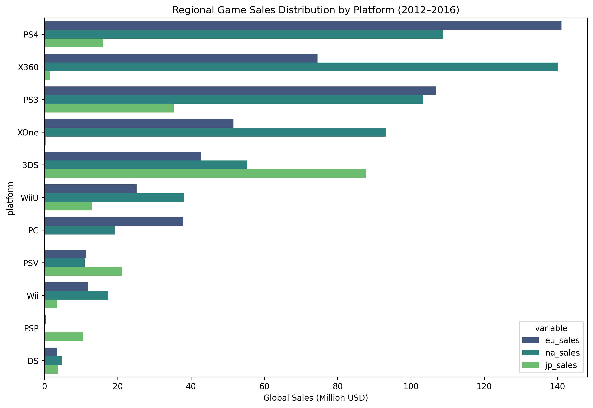
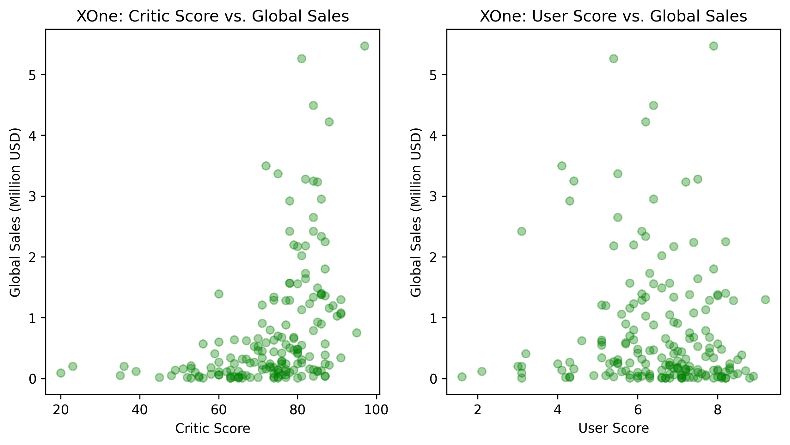
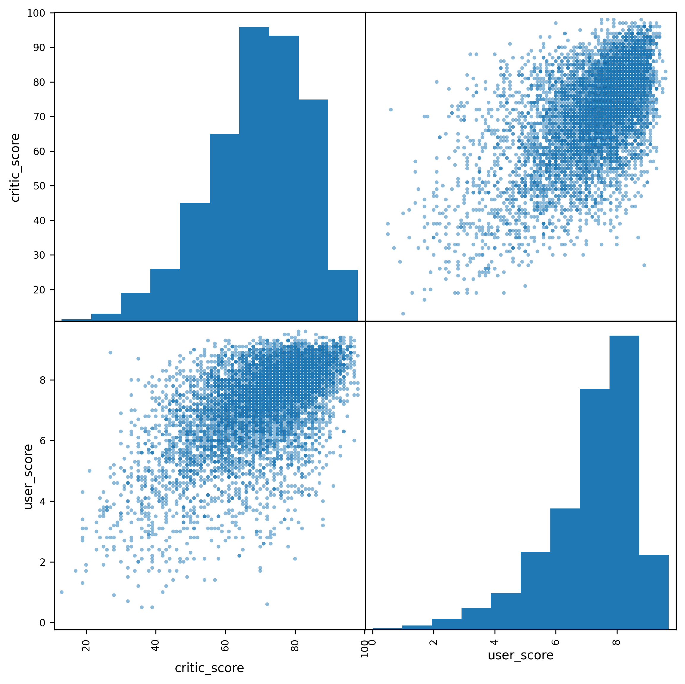
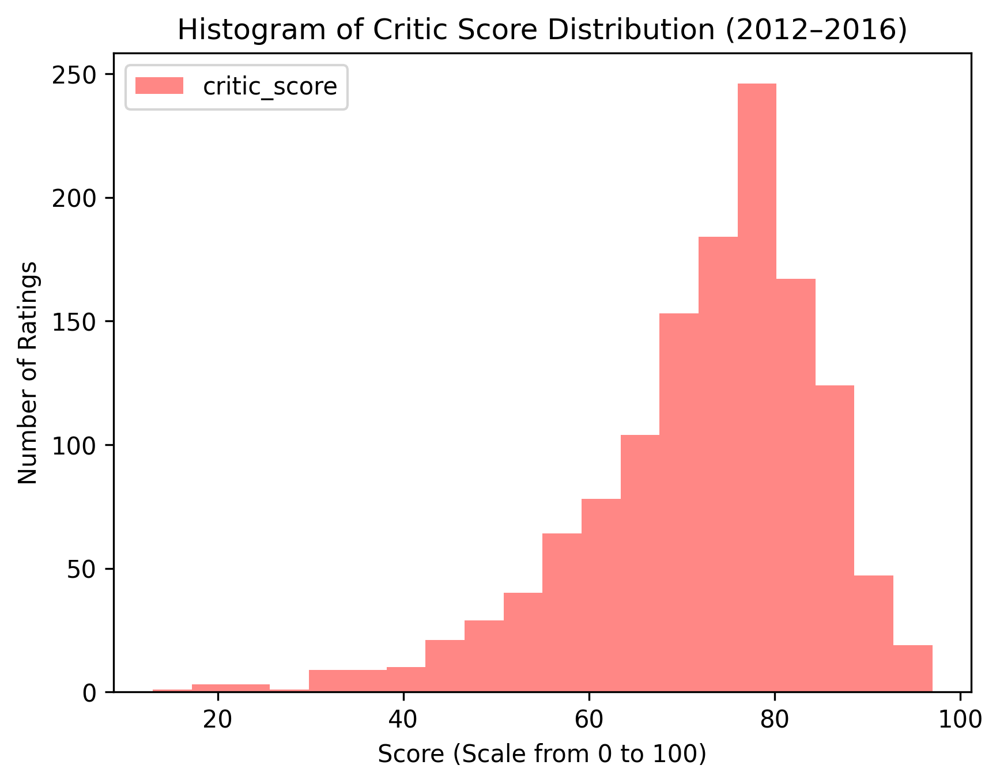
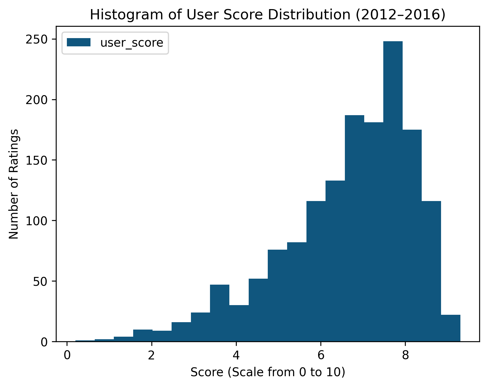

## Video Game Market Analysis

### Objective

An online video game store needs to analyze the gaming market to:

 Identify key factors contributing to a game's success.

 Define user profiles for different regions.

 Test business hypotheses to predict potentially popular games and optimize marketing strategies for business growth.

### Project Overview

 This project aims to provide a comprehensive analysis of the video game market using a dataset spanning over three decades. By leveraging data science techniques, we explore industry trends, sales distributions, and factors influencing game popularity. The insights gained can help businesses make informed decisions regarding game development, marketing, and distribution strategies.

### Key aspects of the project include:

Data Cleaning & Preprocessing: Handling missing values, data transformation, and ensuring data consistency.

Exploratory Data Analysis (EDA): Uncovering patterns in game sales, genre preferences, and regional differences.

Statistical Analysis: Understanding correlations between game attributes and sales performance.

Predictive Modeling (Optional): Building models to forecast game sales based on historical data.

### Dataset Information

The dataset is sourced from public records and stored in games.csv. It covers the period from 1983 to 2016, though 2016 data may be incomplete.

Dataset Description (games.csv):

Name — Title of the game

Platform — Gaming platform (e.g., PlayStation, Xbox, PC)

Year_of_Release — Release year of the game

Genre — Game genre (e.g., Action, RPG, Strategy)

NA_sales — Sales in North America (millions of dollars)

EU_sales — Sales in Europe (millions of dollars)

JP_sales — Sales in Japan (millions of dollars)

Other_sales — Sales in other regions (millions of dollars)

Global_Sales — Total worldwide sales (millions of dollars)

Critic_Score — Critic ratings (0 to 100)

User_Score — User ratings (0 to 10)

Rating — ESRB rating (e.g., E, T, M)

### Step-by-Step Walkthrough

### 1. Data Preprocessing

Handling missing values

Converting data types for better analysis

Filtering out irrelevant records

### 2. Exploratory Data Analysis (EDA)

Below are some of the key visualizations used in the analysis:

### Data Insights & Visualizations

### Number of Games Released Per Year

The number of games released over time shows an upward trend from the 1980s to the late 2000s, peaking around 2008-2009, followed by a decline in recent years.

    

This trend suggests that the gaming industry went through an era of expansion, but possibly due to market saturation or evolving business models (e.g., digital downloads and live-service games), the volume of new releases declined.

### Sales Distribution by Platform & Region

Examining video game sales across platforms and regions helps in identifying key market trends. The following visualization provides an overview of global sales across major platforms from 2012 to 2016.

    

Key Observations:

PlayStation 4 (PS4) and Xbox 360 were the dominant platforms in terms of global sales.

Japan had a strong preference for handheld consoles (e.g., Nintendo 3DS) compared to other regions.

North America was the leading market for most gaming platforms, followed by Europe.

### Critic & User Scores vs. Global Sales

To understand how game ratings impact sales, we analyzed the correlation between critic scores and user scores with global sales.

Critic Score vs. Global Sales

    

User Score vs. Global Sales

    

Key Takeaways:

Higher critic scores correlate more strongly with higher global sales.

Some low-rated games still had high sales, indicating that brand recognition and marketing significantly impact sales performance.

User scores show a wider variance, suggesting that gamers’ opinions may not always align with critic reviews.

### Distribution of Critic & User Scores

To further investigate score distributions, we analyze the spread of critic and user ratings for games released between 2012-2016.

Critic Score Distribution

    

User Score Distribution

    

Observations:

Critic scores are mostly concentrated between 60-85, with very few games scoring below 30.

User scores exhibit a wider range, indicating greater diversity in player opinions compared to critic reviews.

### 3. Business Insights

The number of games released peaked around 2008-2009 and has declined since.

North America remains the dominant market, with Japan contributing heavily to specific genres.

Games with high critic scores tend to have better global sales, but the correlation is not absolute.

Action and Sports genres have been historically popular, leading to high sales figures.

### 4. Conclusion

The findings suggest that market trends, regional preferences, and critical reception play a major role in game sales performance. Companies can leverage these insights to tailor their game development and marketing strategies.

Game releases peaked in 2008-2009 before experiencing a decline, suggesting shifts in the industry’s release strategies.

Platform & regional preferences differ significantly, with North America leading in sales.

Critic scores have a stronger correlation with game sales than user scores, reinforcing the importance of professional reviews.

Marketing and branding influence game success, as some games with lower ratings still achieved high sales.

### Running the Notebook

Installation

Ensure you have the required dependencies installed:

pip install pandas matplotlib seaborn numpy

Running the Notebook

Execute the Jupyter Notebook in the terminal:

jupyter notebook video_game_analysis.ipynb

Repository Contents

video_game_analysis.ipynb - Jupyter Notebook containing full analysis.

games.csv - Dataset used for the analysis.

README.md - Project documentation.

Author

Developed by Sandeep Ghotra as part of a data analysis project.

